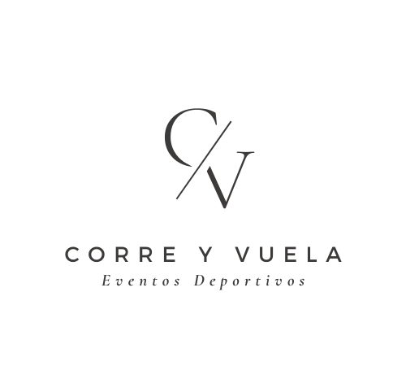

# Mi Proyecto: Corre y Vuela 
 

## Descripción
Esta empresa consiste en organizar Eventos Deportivos al aire libre, es decir, organizar carreras de senderismo, running y ciclismo al aire libre con espestáculos audiovisuales

### Características Principales
- Organización de carreras de running, ciclismo y senderismo
- Sistema de inscripción en línea para carreras y eventos
- Seguimiento en tiempo real de participantes durante los eventos
- Seguimiento de los eventos audiovisuales a través de la aplicación
- Integración con redes sociales para compartir logros, fotos y experiencias
- 
## Próximos Eventos
| Evento               | Fecha       | Ubicación         | Distancia   |
|---------------------|-------------|-------------------|-------------|
| San Silvestre Olvereña| 31/12/2024  | Olvera   | 3km, 6km, 12km |
| Open Sierra de Cádiz | 15/05/2025  | Olvera, Algodonales y Alcala del Valle | 21km, 42km |
| Tour Sierra de Cádiz| 22/08/2025  | Ronda, Arriate, Setenil, Alcala y Olvera| 130km|


## Nuestro espacio
[Visita Corre Y Vuela](https://www.instagram.com/correyvuela_eventos/)

### Contactarnos
Correo: correyvuela.contacto@gmail.com
Telefono: 642777183
dirección: Olvera, Cádiz

```python
# Función para calcular el tiempo estimado de una carrera
def calcular_tiempo_carrera(distancia_km, velocidad_kmh):
    tiempo_horas = distancia_km / velocidad_kmh
    horas = int(tiempo_horas)
    minutos = int((tiempo_horas - horas) * 60)
    return f"{horas:02d}:{minutos:02d}"

# Ejemplo de uso
distancia = 42.2  # Maratón
velocidad = 12    # 12 km/h

tiempo_estimado = calcular_tiempo_carrera(distancia, velocidad)
print(f"Tiempo estimado para un maratón a 12 km/h: {tiempo_estimado}")


